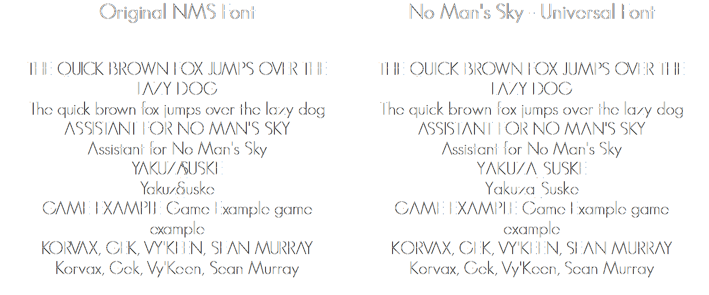
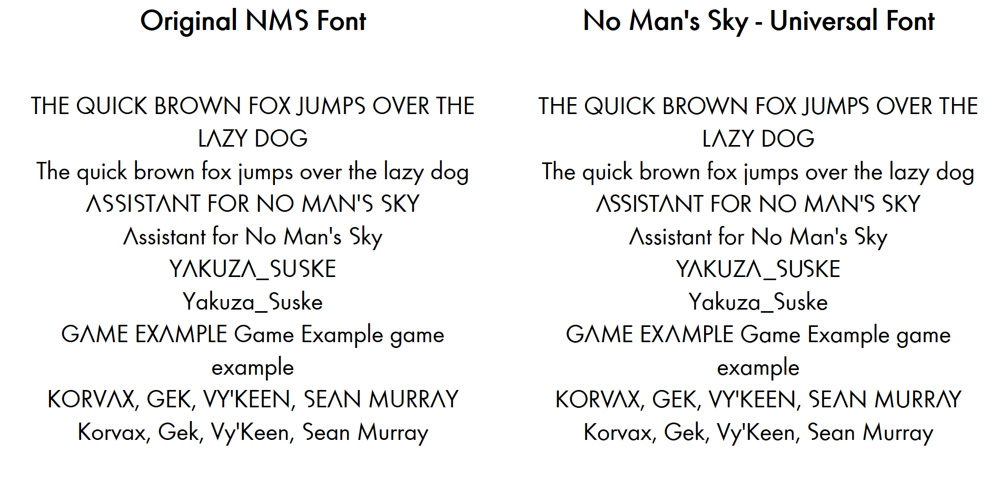

# No Man's Sky - Universal Font

As far as we have observed, there have been two fonts that carry the iconic NMS typographic style: the "NMSGeoSansLight" webfont in use on [the official NMS site](https://nomanssky.com), and an alternative version datamined from the game files that seems to be based on the Futura Pro font family. This project aims to bring to creators the fixed versions of the fonts.

[](https://github.com/NMSCD)

### GeoSans Version: (download [ttf](https://github.com/NMSCD/No-Mans-Sky-Universal-Font/raw/master/assets/font/NMSGeoSans_Kerned/Web-TT/NMSGeoSans_Kerned.ttf) | [woff](https://github.com/NMSCD/No-Mans-Sky-Universal-Font/raw/master/assets/font/NMSGeoSans_Kerned/Web-TT/NMSGeoSans_Kerned.woff))


### FuturaProBook Version: (download [ttf](https://github.com/NMSCD/No-Mans-Sky-Universal-Font/raw/master/assets/font/NMSFuturaProBook_Kerned/Web-TT/NMSFuturaProBook_Kerned.ttf) | [woff](https://github.com/NMSCD/No-Mans-Sky-Universal-Font/raw/master/assets/font/NMSFuturaProBook_Kerned/Web-TT/NMSFuturaProBook_Kerned.woff))



### Using the fonts on your sites
Thanks to Github Pages, the fonts are readily available to be integrated into your sites by simply importing the relevant CSS files into them. It has the added advantage of fetching only the latest and greatest versions of the font files. The `font-family` names are mentioned below.<br>**NOTE:** Only use CSS `@import` statements, not inline stylesheet links in your html files. The CSS imports correctly fetch the font files relative to the CSS file path, whereas a html link will not.

```css
/* font-family: NMSFuturaProBook */
@import url('https://font.nmscd.com/assets/font/NMSFuturaProBook_Kerned/Web-TT/NMSFuturaProBook_Kerned.css');

/* font-family: NMSGeoSans */
@import url('https://font.nmscd.com/assets/font/NMSGeoSans_Kerned/Web-TT/NMSGeoSans_Kerned.css');

```

